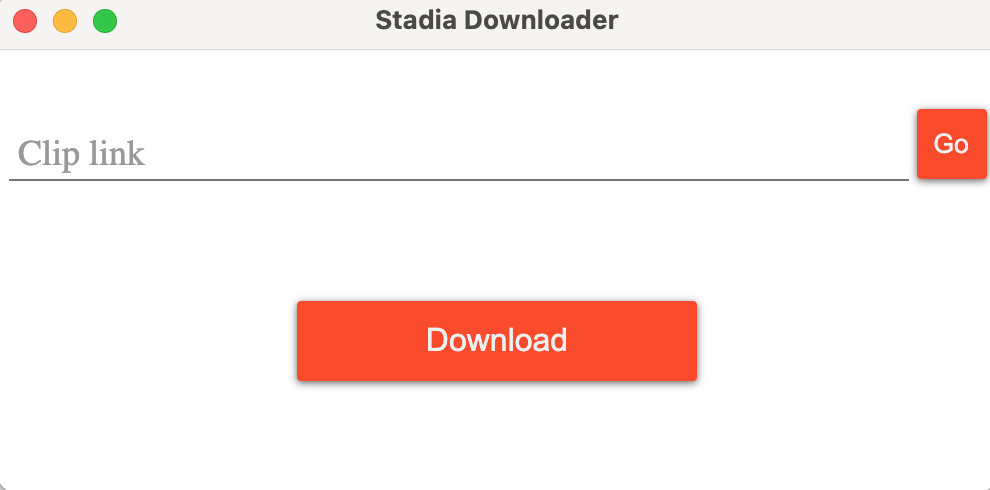

<!--
*** Thanks for checking out the Best-README-Template. If you have a suggestion
*** that would make this better, please fork the repo and create a pull request
*** or simply open an issue with the tag "enhancement".
*** Thanks again! Now go create something AMAZING! :D
-->


<!-- PROJECT SHIELDS -->
<!--
*** I'm using markdown "reference style" links for readability.
*** Reference links are enclosed in brackets [ ] instead of parentheses ( ).
*** See the bottom of this document for the declaration of the reference variables
*** for contributors-url, forks-url, etc. This is an optional, concise syntax you may use.
*** https://www.markdownguide.org/basic-syntax/#reference-style-links
-->


<!-- PROJECT LOGO -->
<br />
<p align="center">
  <a href="https://github.com/markelz0r/stadia-downloader">
    
  </a>

  <h3 align="center">Stadia Downloader</h3>

  <p align="center">
    An awesome tool serving all your Stadia clip downloading needs
    <br />
    <br />
    <a href="https://github.com/othneildrew/Best-README-Template/issues">Report Bug</a>
    ·
    <a href="https://github.com/othneildrew/Best-README-Template/issues">Request Feature</a>
  </p>
</p>


[![Build][build-shield]][build-url]
[![Issues][issues-shield]][issues-url]
[![Downloads][downloads-shield]][downloads-url]
[![GPL License][license-shield]][license-url]


<!-- TABLE OF CONTENTS -->
<details open="open">
  <summary>Table of Contents</summary>
  <ol>
    <li>
      <a href="#about-the-project">About The Project</a>
    </li>
    <li>
      <a href="#getting-started">Getting Started</a>
      <ul>
        <li><a href="#building-the-project">Building the project</a></li>
      </ul>
    </li>
    <li><a href="#roadmap">Roadmap</a></li>
    <li><a href="#contributing">Contributing</a></li>
    <li><a href="#license">License</a></li>
    <li><a href="#contact">Contact</a></li>
  </ol>
</details>


<!-- ABOUT THE PROJECT -->
## About The Project


Google Stadia comes with a great feature allowing you to save 30 second clips and share those using the link. 
The problem is that there is (currently) no way to doanload clips using link share feature. Also you can only download your own clips in 1080p resolution which isn't great either

Here comes Stadia Downloader:
  * Download your own clips with desired resoltion (up to 2160p)
  * Download other people's clips shared by link


<!-- GETTING STARTED -->
## Getting Started

You can install Stadia Downloader using pre-built binaries for Windows, macOS and Linux. 
Check out [Releases](https://github.com/markelz0r/stadia-downloader/releases) to get the latest version.

Alternatively you can compile the project yourself

### Building the project

1. Clone the repo
   ```sh
   git clone https://github.com/markelz0r/stadia-downloader.git
   ```
2. Install NPM packages
   ```sh
   npm install
   ```
3. Run the project
   ```sh
   npm start
   ```


<!-- ROADMAP -->
## Roadmap

See the [open issues](https://github.com/othneildrew/Best-README-Template/issues) for a list of proposed features (and known issues).


<!-- CONTRIBUTING -->
## Contributing

Contributions are what make the open source community such an amazing place to be learn, inspire, and create. Any contributions you make are **greatly appreciated**.

1. Fork the Project
2. Create your Feature Branch (`git checkout -b feature/AmazingFeature`)
3. Commit your Changes (`git commit -m 'Add some AmazingFeature'`)
4. Push to the Branch (`git push origin feature/AmazingFeature`)
5. Open a Pull Request to main branch


<!-- LICENSE -->
## License

Distributed under the GPL-3.0 License. See `LICENSE` for more information.


<!-- CONTACT -->
## Contact

Andrew Odintsov - [@a1covker](https://twitter.com/a1covker)

Project Link: [https://github.com/markelz0r/stadia-downloader](https://github.com/markelz0r/stadia-downloader)


<!-- MARKDOWN LINKS & IMAGES -->
<!-- https://www.markdownguide.org/basic-syntax/#reference-style-links -->
[build-shield]: https://img.shields.io/travis/markelz0r/stadia-downloader
[build-url]: https://travis-ci.org/github/markelz0r/stadia-downloader
[issues-shield]: https://img.shields.io/github/issues/markelz0r/stadia-downloader
[issues-url]: https://github.com/markelz0r/stadia-downloader/issues
[license-shield]: https://img.shields.io/github/license/markelz0r/stadia-downloader
[license-url]: https://github.com/markelz0r/stadia-downloader/blob/main/LICENSE
[downloads-shield]: https://img.shields.io/github/downloads/markelz0r/stadia-downloader/total
[downloads-url]: https://github.com/markelz0r/stadia-downloader/releases
[product-screenshot]: img/screenshot.png=250x
